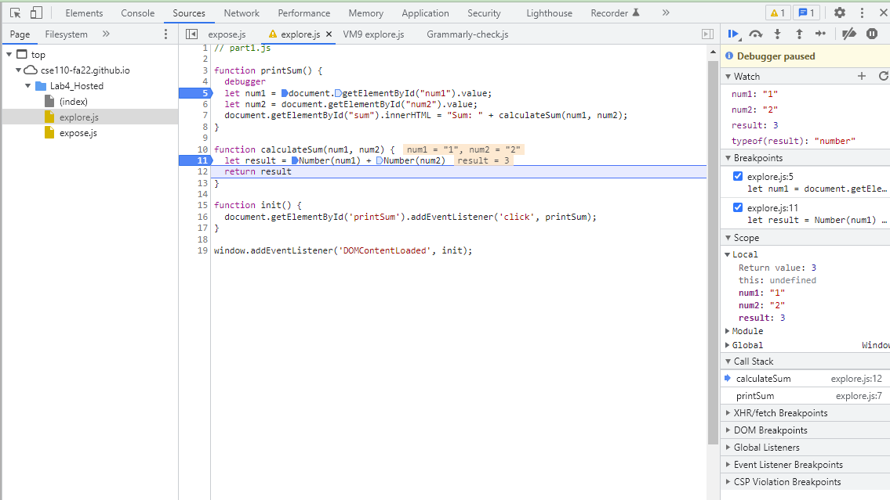

1. The bug is located at line 11. The bug is the data type of num1 and num2 is considered as String, which is not correct. We want the data type of num1 and num2 to be Number to do the calculation.
2. To fix it, we cast num1 and num2 with data type Number, then line 11 becomes to let result = Number(num1) + Number(num2).
   